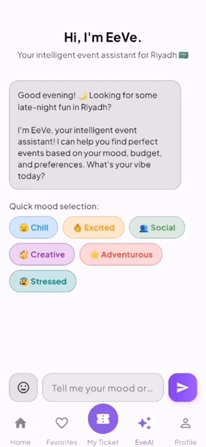

# EeVe – Your Smart Event Guide in Riyadh 🎉

EeVe is a mobile app we created to help people in Riyadh find real events that match their mood, vibe, and budget — instantly. No more endless scrolling or random searches. Just type what you're in the mood for, and EeVe suggests events that actually make sense for you.

From concerts to cafés, festivals to chill weekend plans — EeVe uses AI to help you find something fun, fast.

---

## 💡 Why We Built EeVe

We noticed that even though there are so many events happening in Riyadh, there isn’t a smart way to *find* the right one. Most apps show everything, everywhere — even stuff that doesn’t match what you want or isn’t happening near you.

So we decided to build something better:
- Focused only on Riyadh
- Easy to use with a chat-based assistant
- Powered by real event data
- Designed using prompt engineering to make the AI respond naturally

---

## ✨ What EeVe Can Do

- AI Chat Assistant  
  Talk to EeVe like you would a friend:  
  *“Any fun events in Riyadh this Friday?”*  
  The assistant gives smart suggestions pulled from real data.

- Riyadh-Based Events Only  
  We made sure every event in the app is local. No distractions.

- Real-Time Event Matching  
  The AI compares your message with event titles and suggests the best fit.

- Simple, Clean UI  
  We used Flutter + GetX to build a smooth, fast, and modern user experience.

- Prompt Engineering  
  We crafted custom prompts so the AI gives helpful, friendly, and clear replies every time.

---
## 📸 Screenshots

| Home                                         | Event Details                                             | My Tickets                                                  |
|----------------------------------------------|--------------------------------------------------------|---------------------------------------------------------------|
|      |       |  |

> Find more views inside the `/ScreenShots/dark mode/` folder.  
> or `/ScreenShots/light mode/` folder

### ✨ EeVe adapts to your style!

Whether you love bright, clean designs or prefer a sleek dark interface —  
EeVe supports both **Light Mode** and **Dark Mode** for a smooth, comfortable experience any time of day.


---

## Demo

<p style="text-align: center;">
  
  
</p>

---

##  Tech & Tools We Used

- Flutter – Mobile UI development
- Supabase – Event data and user authentication
- OpenAI GPT-3.5 – AI assistant responses
- Prompt Engineering – To shape AI behavior and tone
- Figma – UI/UX design and prototyping ([View Design](https://www.figma.com/design/Wlp6zxdrlQVdOyF3WKhdJC/Eeve-project?node-id=0-1&p=f&t=Bd7Ol6PNdNNFDvx0-0))
- Dart – Programming language

##  Packages We Used

We used the following Flutter packages in our project:

- shared_preferences – to store user preferences locally
- flutter_credit_card – to handle credit card UI
- http – for API requests
- image_picker – to let users pick images from the gallery or camera
- credit_card_form – additional credit card form support
- provider – for state management in specific screens
- dart_openai – to connect with the OpenAI API
- blur – for UI blur effects
- flutter_screenutil – for responsive screen sizing


---

##  Our Team

- Leader : Naba Oulad Yaich
- Roba Almalki 
- Lama Alsaedi 
- Rana Alotmi 
- Ammar Aloufy 

---

##  How to Run the App

```bash
install the key we sent via email 
then use it in inside the openai_config.dart file 

flutter pub get
flutter run